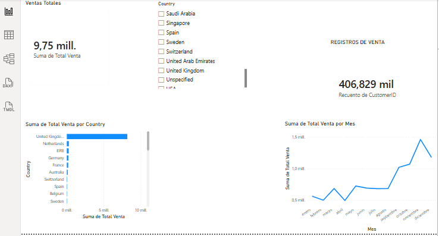

# Sales Data Analysis Project

## Overview

This project analyzes sales performance using Excel, SQL, and Power BI.

The objective was to identify sales trends, top-performing countries, seasonal patterns, and key business insights from a large e-commerce dataset containing more than 400,000 transactions.

---

## Tools Used

* Excel
* SQL
* Power BI

---

## Business Questions

1. Which countries generate the highest sales revenue?
2. What are the monthly sales trends?
3. Which periods show peak sales activity?
4. What insights can support business growth?

---

## Data Preparation

* Data cleaning in Excel
* Removal of invalid records
* Data validation
* Transformation for analysis

---

## SQL Analysis

The following analyses were performed:

* Total sales calculation
* Sales by country
* Monthly sales trends
* Ranking of countries by revenue

---

## Power BI Dashboard

The dashboard includes:

* Total Sales KPI
* Total Transactions KPI
* Sales by Country
* Monthly Sales Trend
* Interactive Filters

### Dashboard Preview

---

## Key Findings

* The United Kingdom generated the highest sales volume.
* Sales were highly concentrated in a small number of countries.
* November and December showed the highest sales activity.
* Clear seasonal patterns were identified across the dataset.

---

## Business Recommendations

1. Increase marketing investment before the November–December peak season.

2. Develop customer retention campaigns in the United Kingdom, the strongest-performing market.

3. Expand commercial efforts in secondary high-performing countries to reduce dependence on a single market.

4. Implement customer segmentation strategies to improve targeting and increase repeat purchases.

5. Monitor monthly KPIs through automated dashboards to support faster decision-making.

6. Use historical sales patterns to improve inventory planning before seasonal demand increases.

---

## Author

Mario Fernando García Rojas

Junior Data Analyst Portfolio Project

